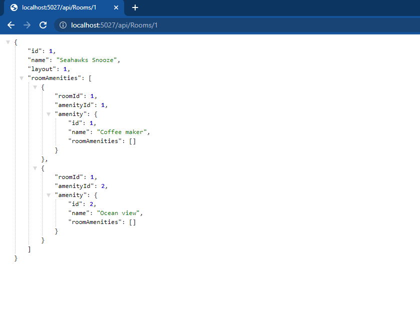

# Async-Inn-App

## Introduction
Async-Inn-App is .NET Core Web Application to implement API server , API services are a means for an application to interact with a server-side system to retrieve and/or update data. API as a Service, then, is a platform or tool that offers support for designing and deploying API services.
Using EF core (Entity Framework) : EF Core can serve as an object-relational mapper (O/RM), enabling .NET developers to work with a database using .NET objects, and eliminating the need for most of the data-access code they usually need to write.

## Async-Inn Hotel database ERD diagram

## Startup
- Create a new Empty .NET Core Web Application
**Setup Entity Framework**
Install the Entity Framework Dependencies for your app

- From Manage NuGet Packages Add:

- [ ] `Microsoft.EntityFrameworkCore.SqlServer`
- [ ] `Microsoft.EntityFrameworkCore.Tools`

Install `ef` command line tool

- From a terminal

- [ ] `dotnet tool install --global dotnet-ef`
- [ ] `dotnet ef`

## Data Models and SQL Tables

Tell now this project have 3 models present database table for the database digram 

1. Hotel Class : Hotels: Hotels can have multiple rooms and are connected to those rooms through the HotelRoom table.

```C#
public class Hotel
    {
        public int Id { get; set; }
        public string Name { get; set; }
        public string StreetAddress { get; set; }
        public string City { get; set; }
        public string State { get; set; }
        public string Country { get; set; }
        public string Phone { get; set; }
    }
```

2. Room Class : Rooms are not specific rooms, but more like room types. Thus, a Hotel can have multiple Rooms, and a Room can belong to many Hotel locations. Rooms are related to Hotels through the HotelRoom table.
```C#
 public class Room
    {
        public int Id { get; set; }
        public string Name { get; set; }
        public int Layout { get; set; }
    }
```
3. Amenity Class : The Amenities table holds room features like AC, Coffee maker, etc. An amenity type can belong to many different rooms, and a room can have many different amenities. This many:many relationship is captured in the RoomAmenities join table.
```C#
 public class Amenity
    {
        public int Id { get; set; }
        public string Name { get; set; }
    }
```

## Seeding data

Seed data is data that you populate the database with at the time it is created. You use seeding to provide initial values for lookup lists.

- Add default data for all three of your simple models

- Hotels seed data
```C#
 modelBuilder.Entity<Hotel>().HasData(
              new Hotel { Id = 1, Name = "The Westin Milwaukee", StreetAddress= "260-C North El Camino Rea", City= "Chicago", State= "Illinois", Country= "united state", Phone= "12163547758" },
              new Hotel { Id = 2, Name = "Wyndham Buena", StreetAddress = "591 Grand Avenue", City = "Los Angeles", State = "California", Country = "united state", Phone = "12099216581" },
              new Hotel { Id = 3, Name = "Monumental Movieland Hotel", StreetAddress = "1186 Roseville Pkwy", City = "Houston", State = "Texas", Country = "united state", Phone = "15042010052" }
            );
```

- Rooms seed data
```C#
            modelBuilder.Entity<Room>().HasData(
                new Room { Id = 1, Name = "Seahawks Snooze", Layout = 1 },
                new Room { Id = 2, Name = "Restful Rainier", Layout = 0 },
                new Room { Id = 3, Name = "Honeymoon suites", Layout = 2 }
                );
```
- Amenities seed data
```C#
            modelBuilder.Entity<Amenity>().HasData(
                new Amenity { Id = 1, Name = "Coffee maker" },
                new Amenity { Id = 2, Name = "Ocean view" },
                new Amenity { Id = 3, Name = "Air conditioning" }
                );
```

## Controllers

Now that we have completed our “Code First Migrations” in the directions above. Let’s add some routes so that we can access the data through an API.
CRUD is an acronym that stands for CREATE, READ, UPDATE, and DELETE. These four database commands are the foundation of CRUD. This acronym is well-known among programmers, but many software developers view it as more of guidance since CRUD was not made as a modern way to create API.

**This Controllers Contain all endpoint and functions to implement for all crud operations (Get , Put ,Post , Delete)**

- HotelsController
    - GET: api/Hotels
    
    

    - GET: api/Hotels/5 by id

    

    - PUT: api/Hotels/5 update hotel data by id
    - POST: api/Hotels Add new hotel by id
    - DELETE: api/Hotels/5 to delete current hotel by id

- RoomsController
    - GET: api/Rooms

    

    - GET: api/Rooms/5 by id

    

    - PUT: api/Rooms/5 update Room data by id
    - POST: api/Rooms Add new Room by id
    - DELETE: api/Rooms/5 to delete current Room by id

- AmenitiesController
    - GET: api/Amenities

    

    - GET: api/Amenities/5 by id

    

    - PUT: api/Amenities/5 update Amenitie data by id
    - POST: api/Amenities Add new Amenitie by id
    - DELETE: api/Amenities/5 to delete current Amenitie by id

> Note that all Controller inherent from base class **ControllerBase**

## Repository Design Pattern
The Repository Design Pattern its Mediates between the domain and the data mapping layers using a collection-like interface for accessing the domain objects.

In other words, we can say that a Repository Design Pattern acts as a middleman or middle layer between the rest of the application and the data access logic.

Here we have three layer Interfaces for all CRUD operations :

- Hotel interface

```C#
Task<Hotel> Create(Hotel hotel);

        Task<List<Hotel>> GetHotels();

        Task<Hotel> GetHotel(int id);

        Task<Hotel> UpdateHotel(int id , Hotel hotel);

        Task DeleteHotel(int id);
```

- Room interface

```C#
Task<Room> Create(Room room);

        Task<List<Room>> GetRooms();

        Task<Room> GetRoom(int id);

        Task<Room> UpdateRoom(int id, Room room);

        Task DeleteRoom(int id);
```

- IAmenitie interface

```C#
Task<Amenity> Create(Amenity amenity);

        Task<List<Amenity>> GetAmenities();

        Task<Amenity> GetAmenity(int id);

        Task<Amenity> UpdateAmenity(int id, Amenity amenity);

        Task DeleteAmenity(int id);
```

- Finlly need to add services fro all layers in **startup.cs** class

```C#
services.AddTransient<IHotel, HotelServices>();
            services.AddTransient<IRoom, RoomServices>();
            services.AddTransient<IAmenitie, AmenitieServices>();
```
## Navigation Properties 

Add Navigation Properties to relation table (RoomAmenity , HotelRoom)

- RoomAmenity

```C#
public class RoomAmenity
    {
        public int RoomId { get; set; }
        public int AmenityId { get; set; }

        // Navigation Properties

        public Room Room { get; set; }
        public Amenity Amenity { get; set; }
    }
```
- HotelRoom

```C#
public class HotelRoom
    {
        public int HotelId { get; set; }
        public int RoomNumber { get; set; }
        public int RoomId { get; set; }
        public decimal Rate { get; set; }
        public int PetFrienndly { get; set; }


        // Navigation Properties

        public Hotel Hotel { get; set; }
        public Room Room { get; set; }
    }
```

## Routing

Add specific Routing for all CRUD operations for relation table to get data between tow table

- Add new Amenity To specific Room in this following EndPoint : **api/Rooms/5/Amenity/5**

```C#
 // POST : api/Rooms/5/Amenity/5
        [HttpPost]
        [Route("{roomId}/Amenity/{amenityId}")]
        public async Task<IActionResult> AddAmenityToRoom(int roomId, int amenityId)
        {
            await _room.AddAmenityToRoom(roomId, amenityId);

            return NoContent();
        }
```
- Add Amenity To Room with stutus : 204 NoContent


- After Add Amenity To Room



- Remove old Amentity From specific Room in this following EndPoint : **api/Rooms/5/Amenity/5**

```C#
// DELETE : api/Rooms/5/Amenity/5
        [HttpDelete]
        [Route("{roomId}/Amenity/{amenityId}")]
        public async Task<IActionResult> RemoveAmentityFromRoom(int roomId, int amenityId)
        {
            await _room.RemoveAmentityFromRoom(roomId,amenityId);

            return NoContent();
        }
```
- Delete Amenity from Room with stutus : 204 NoContent


- After Delete Amenity from Room


## HotelRoom Controller 

Modify the routes for all CURD operations in this controller for the following:

- GET all the rooms for a hotel: /api/HotelRooms/{hotelId}/Rooms


- GET all room details for a specific room: /api/HotelRooms/{hotelId}/Rooms/{roomNumber}


- POST to add a room to a hotel: /api/HotelRooms/{hotelId}/Rooms


- PUT update the details of a specific room: /api/HotelRooms/{hotelId}/Rooms/{roomNumber}


- DELETE a specific room from a hotel: /api/HotelRooms/{hotelId}/Rooms/{roomNumber}


## Code Reference

[Async-Inn-App](./Async-Inn/Async-Inn/)